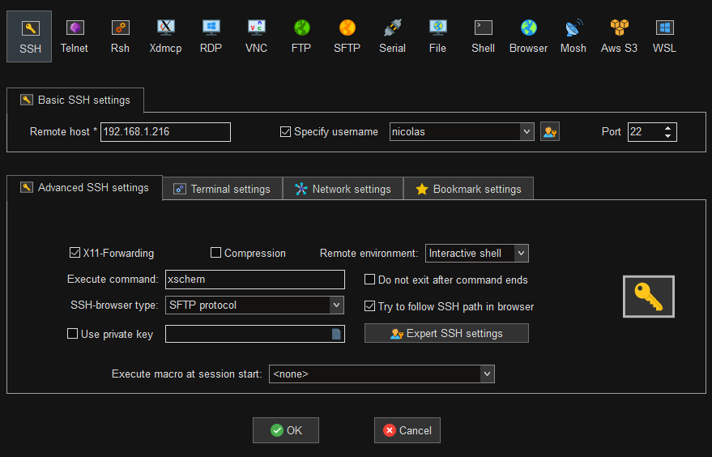

#### Installing xschem on Ubuntu
Install the following packages:

````bash
sudo apt install -y git build-essential cmake \
libx11-dev libxpm-dev libxft-dev libxext-dev \
tcl-dev tk-dev libx11-dev libxrender-dev \
libxrandr-dev libxinerama-dev libxcursor-dev \
libxfixes-dev \
libgtk2.0-dev pkg-config\
flex bison\
autoconf automake
````

Clone source from github:
````bash
git clone https://github.com/StefanSchippers/xschem.git
````

Configure, build and install xschem (system wide):
````bash
./configure 
make
sudo make install
````

Test xschem is working:
````bash
xschem
````

#### Using MobaXterm

MobaXTerm on Windows is the only solution that worked out of the box, it only requires minimal configuration on the Ubuntu machine:

````bash
sudo apt install openssh
````

Update the configuration files for the SSH server to forward X session over SSH. 
````bash
sudo nano /etc/ssh/sshd_config 

X11Forwarding yes
X11DisplayOffset 10
X11UseLocalhost yes
````
On windows side, install [MobaXterm](https://mobaxterm.mobatek.net/download-home-edition.html) and then configure the session to start xschem on launch:



