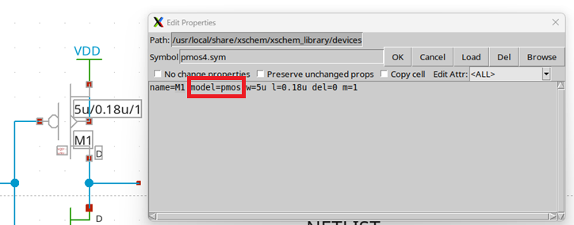
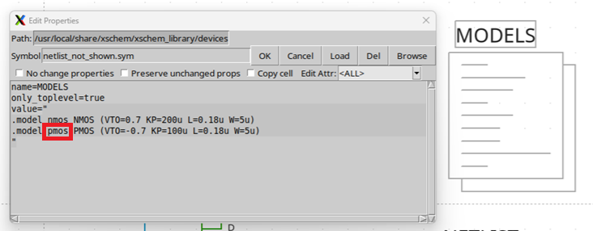

### Schematics

In xschem the models are stored on the schematic directly. With a symbol named `netlist_not_shown.sym` models can be defined in spice. 

**Example**: 
````spice 
name=MODELS 
only_toplevel=true 
value="
.model nmos NMOS (VTO=0.7 KP=200u L=0.18u W=5u)
.model pmos PMOS (VTO=-0.7 KP=100u L=0.18u W=5u)
"
````

The model syntax comes from the `spice` documentation see [references](references/ngspice-manual.pdf). 

What is important is to specify the model of the device in its attributes: 



and this model attribute must be specified in the schematic's netlist:



### Warnings - Caveats 

This section is only for me to remember stuffs that I will inevitably forget within 1-2 months timeframe.

#### Title blocks on schematics

Any blocks is selected as soon as clicked on, therefore, an A4 title block symbol will be selected when initiating a drag and drop of any symbols.

Best to stick to `title.sym` to give a semblant of formalism or to explode a title block's frame into lines on the schematic level. 